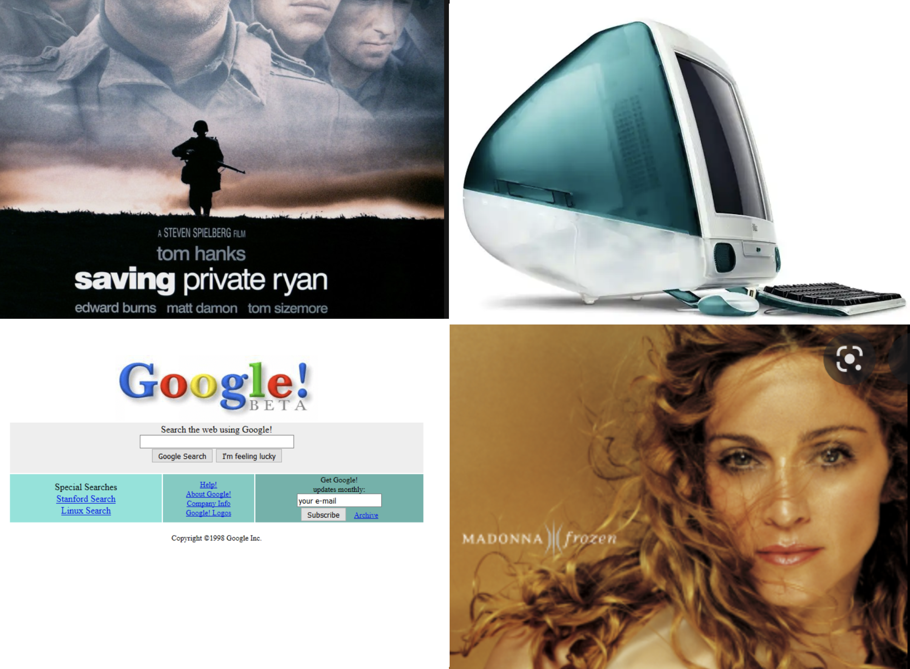
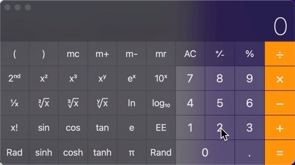
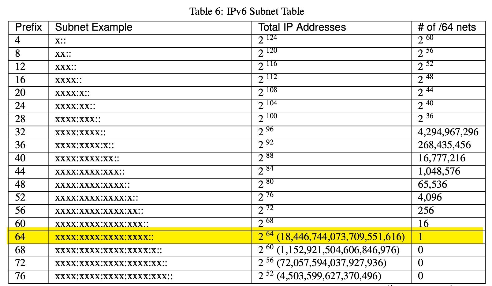

% Teaching Demonstration
% Sable Cantus, CISSP
% May 2nd, 2022

#
Prepared for the fine folks at  
Mt. San Antonio College

#
Access this presentation on the web

[cantus.us/mtsac](https://cantus.us/mtsac)

# ABOUT ME

* Certified Information Systems Security Professional (CISSP)
* Worked in higher education IT for 16 years
* Taught in the classroom since 2009
* U.S. Army Veteran (5 years active)
* [My Certificates and Training](https://cantus.us/certs.html)

# Compare IPv4 and IPv6

* IP = Internet Protocol
* v4 = Version 4
* v6 = Version 6

# 

The Internet Protocol Version 6 Draft standard was completed in December 1998 (RFC 2460)

* *RFC = Request for Comment*

# 1998 Was A Long Time Ago...

* Movie: Saving Private Ryan
* #1 singer: Madonna
* Google was formed 9/4/98
* The first iMac

#

# Why Now?

* American Registry for Internet Numbers (ARIN) ran out of IPv4 addresses on 9/24/2015

# Primary Differences Between 4 and 6

* Address size
* Address formatting
* IPv4 - Private Address Space (RFC 1918) is gone in v6
* IPv4 - Broadcast is gone in v6

# Address Size

* IPv4 uses a 32-bit address
    * 2^32 addresses (about 4 billion)
    * 192.168.100.27

* IPv6 uses a 128-bit address
    * 2^128 addresses (about 34 undecillion)
    * 2603:8000:8803:f24:c6d:94fd:b8f0:a9a8

#
34 Trillion, Trillion, Trillion addresses

#

# Address Format

* An IPv4 address is represented as 4 groups of 3 decimal digits (dotted quad)
* An IPv6 address is represented as eight groups of four hexadecimal digits

#

# IPv6 Security

* IPv6 has [integrated packet encryption](https://www.redhat.com/sysadmin/ipv6-packets-and-ipsec)
* [Internet Protocol Security](https://en.wikipedia.org/wiki/IPsec) (IPsec)

# IPv6 Subnetting

* The standard subnet is a /64
* 2^64 addressses (18.4 quintillion)
* Classless (it's all /64)
* IPv4 subnet mask replaced with IPv6 Prefix Length

#

# Gone are the days...

* Subnet start / end addresses
* Specifying usable addresses
* Null route
* Broadcast address

#

#

# IPv6 Broadcast / Multicast

* IPv6 uses multicast and special addresses to send to the entire segment
* Link-local FF02::1 is analogous to 224.0.0.1
* No broadcast in IPv6
* Neighbor Discovery Protocol (NDP)
* Multicast addresses begin with FF00::/8

#

*IPv6 restores true peer-to-peer connectivity originally in place with IPv4 making proper firewall controls even more important.*

# IPv6 Public / Private

* All IPv6 packets are routed without Network Address Translation (NAT)
* Endpoints can have multiple IPv6 primary addresses
* IPv6 has no private address space (e.g. RFC 1918)
* Entire IPv6 address space, globally, begins with 2001:

#

# IPv6 Public / Private

* Unique local private address (not routed outside)
    * FD00::/8
* IPv6 Link Local addresses begin with FE80::/10
    * IPv4 Automatic Private IP Addressing (APIPA) 169.254.0.0

# Wrapping it Up

IPv6 is different from IPv4 in many ways, but it's still the Internet Protocol and provides a reliable solution for the foreseeable future.

# Handouts

* [IPv6 One Pager](handouts/IPv6.pdf)
* [IPv6 Cheat Sheet](handouts/ipv6_cheat_sheet.pdf)

# Questions?

# Thank You

#

[source code available on github](https://github.com/sc137/mtsac-teaching-demo)

